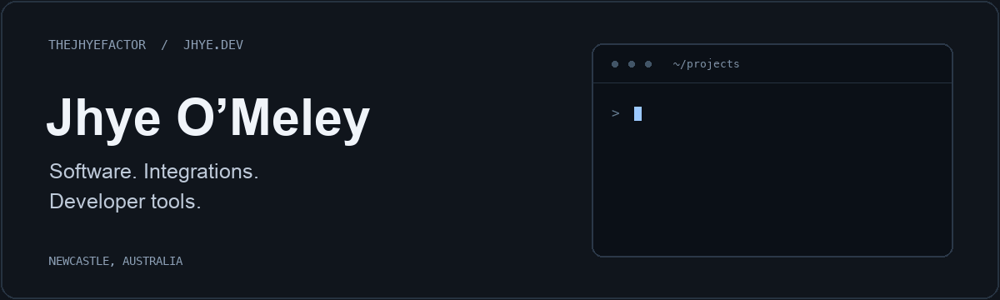

<a href="https://jhye.dev">
  <picture>
    <source media="(prefers-reduced-motion: reduce)" srcset="assets/profile-header-still.png">
    
  </picture>
</a>

  <a href="https://jhye.dev"><strong>Portfolio</strong></a> &nbsp; / &nbsp;
  <a href="https://jhye.dev/work/">Projects</a> &nbsp; / &nbsp;
  <a href="https://jhye.dev/open-source/">Open source</a> &nbsp; / &nbsp;
  <a href="https://www.linkedin.com/in/jhye-o-meley-583223420/">LinkedIn</a> &nbsp; / &nbsp;
  <a href="mailto:omeleyjhye@gmail.com">Email</a>

I'm a software developer working across applications, APIs and connected systems. I build Mac developer tools, explore local AI and security workflows, and contribute fixes to the open-source software I use.

My background includes software engineering at **IntelliDesign** and customer integrations, commissioning and technical support at **Traka / ASSA ABLOY**. I enjoy following a problem from the interface through the API to the system behind it.

## Selected projects

<table>
<tr>
<td width="50%" valign="top">
<h3><a href="https://github.com/TheJhyeFactor/Wixal">Wixal ↗</a></h3>

<strong>An AI workspace for your Mac.</strong>

Local models, project files, saved context, reviewed tools and a terminal in one workspace. Includes a bundled local engine and support for other providers.

Electron · TypeScript · Local inference

<a href="https://github.com/TheJhyeFactor/Wixal/releases/latest">Download for Apple Silicon</a> · <a href="https://github.com/TheJhyeFactor/Wixal">Source</a>

</td>
<td width="50%" valign="top">
<h3><a href="https://github.com/TheJhyeFactor/codex-meter">Codex Meter ↗</a></h3>

<strong>Codex usage in the macOS menu bar.</strong>

A native app for remaining limits, reset times and local usage trends, with a scriptable CLI. API-equivalent cost estimates are kept separate from subscription billing.

Swift · macOS · CLI

<a href="https://github.com/TheJhyeFactor/codex-meter/releases/latest">Releases</a> · <a href="https://github.com/TheJhyeFactor/codex-meter">Source</a>

</td>
</tr>
<tr>
<td width="50%" valign="top">
<h3><a href="https://jhye.dev/work/apertide/">Apertide ↗</a></h3>

<strong>Source review with security findings in context.</strong>

My Code-OSS fork connects SARIF findings, source inspection, optional Ollama assistance, native diff review and recorded checks.

TypeScript · Code-OSS · SARIF · Ollama

<strong>Local alpha.</strong> Custom implementation is local; the public repository currently exposes the upstream fork.

<a href="https://jhye.dev/work/apertide/">Case study &amp; validation</a>

</td>
<td width="50%" valign="top">
<h3><a href="https://jhye.dev">jhye.dev ↗</a></h3>

<strong>The work, with the context behind it.</strong>

Engineering case studies, client projects, career experience and upstream contributions, with implementation details and explicit project status.

Next.js · React · TypeScript

<a href="https://jhye.dev">Visit portfolio</a> · <a href="https://github.com/TheJhyeFactor/jhye-dev">Source</a>

</td>
</tr>
</table>

## Upstream contributions

Practical improvements to reliability, performance and testing. These are merged contributions to projects maintained by other teams.

| Project | Contribution | Evidence |
| :--- | :--- | :--- |
| **Ollama** | Detect stalled model downloads before the first response-body byte. | [Merged #17259](https://github.com/ollama/ollama/pull/17259) |
| **Charm / Crush** | Remove quadratic shell-output rendering and filter language servers before searching PATH. | [Merged #3381](https://github.com/charmbracelet/crush/pull/3381) · [#3370](https://github.com/charmbracelet/crush/pull/3370) |
| **OpenTelemetry Go** | Add cross-platform compile checks to CI. | [Merged #8634](https://github.com/open-telemetry/opentelemetry-go/pull/8634) |
| **W&amp;B RAI Toolkit** | Test the OpenAI-compatible model adapter. | [Merged #48](https://github.com/wandb/rai-toolkit/pull/48) |
| **Internet Archive / Open Library** | Fix template scanning in worktrees without submodule metadata. | [Merged #13533](https://github.com/internetarchive/openlibrary/pull/13533) |
| **ORAS Go** | Clarify repository constructor and scope-helper migration documentation. | [Merged #1378](https://github.com/oras-project/oras-go/pull/1378) · [#1377](https://github.com/oras-project/oras-go/pull/1377) |

**Under review:** [ZAP #7785](https://github.com/zaproxy/zap-extensions/pull/7785), reducing false positives from public fallback responses in 403 bypass checks. [Browse open contributions →](https://github.com/pulls?q=is%3Apr+is%3Aopen+author%3ATheJhyeFactor+archived%3Afalse)

Contribution status checked 6 October 2026. Linked pull requests carry the current status.

## How I work

- **Follow the whole system.** Interfaces, APIs, data, connected hardware and the operational details between them.
- **Make changes reviewable.** Reproduce the problem, keep the change focused, and retain useful tests, benchmarks or check output.
- **Keep AI assistance explicit.** Review generated changes and distinguish a suggestion from a verified result.

**Tools I use:** TypeScript / JavaScript, Python, Go, Swift, React / Next.js, Electron, REST / SOAP, Git and CI.

I'm currently completing the **Diploma of Information Technology in Advanced Programming at TAFE NSW**, with expected graduation in **May 2028**.

---

**Have a software or integration problem to work through?** [Get in touch](mailto:omeleyjhye@gmail.com) or [explore my experience](https://jhye.dev/career/).
